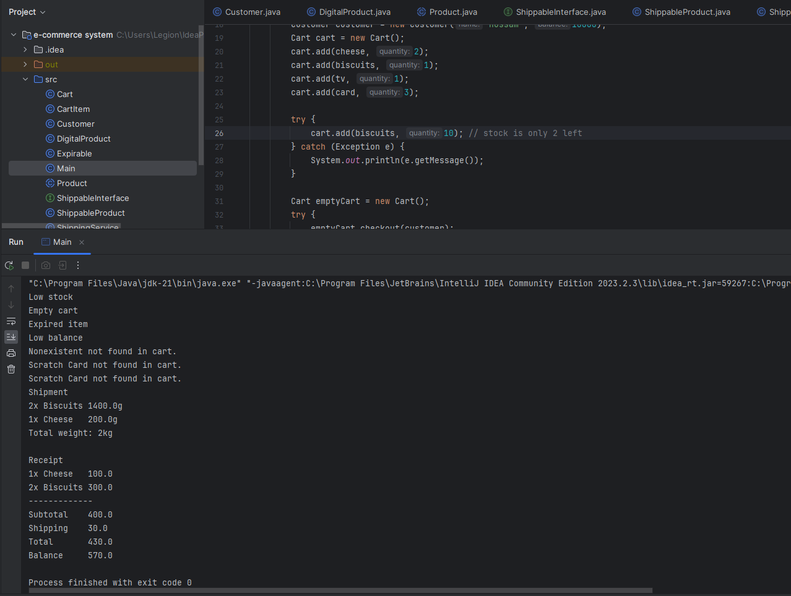

# This My Solution for the Fawry E-commerce System Challenge

## How to Run

1- Clone the repository:

   ```bash
   git clone https://github.com/hosahmed/e-commerce-system-fawry.git
   ```

2- Navigate to the project directory and compile the code:

   ```bash
   javac Main.java
   ```

3- Run the program:

   ```bash
   java Main
   ```


This is a screenshot of the console output:

